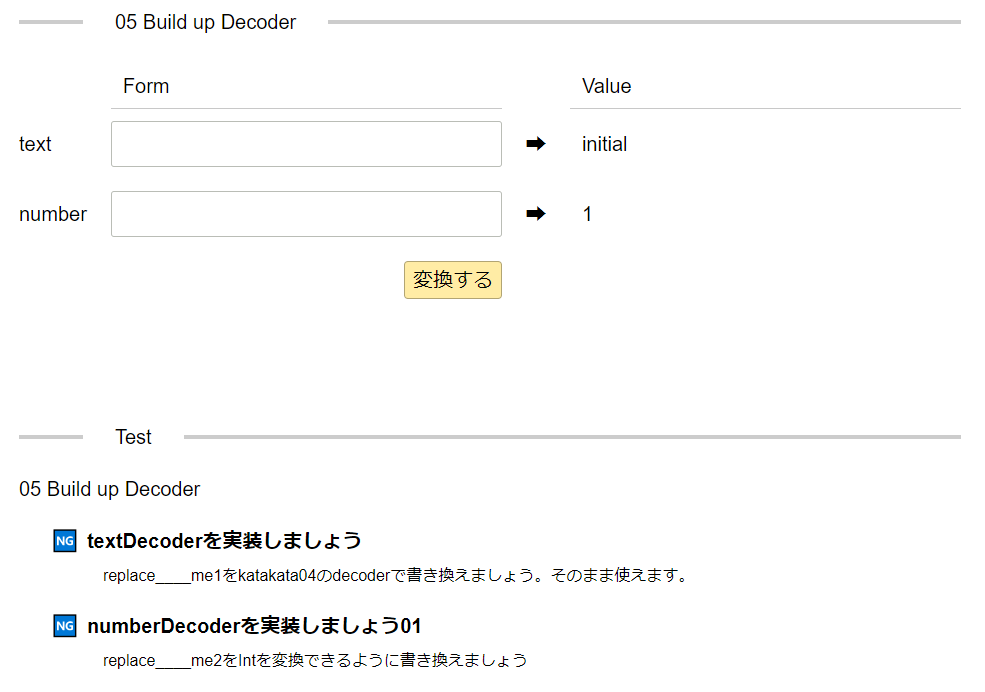

# elm-form-decoder-katakata

[elm-form-decoder](https://package.elm-lang.org/packages/arowM/elm-form-decoder/latest/)の勉強用のkataです

> WIPです

## How to Learn

```sh
git clone https://github.com/miyamoen/elm-form-decoder-katakata.git
cd elm-form-decoder-katakata
elm reactor
```

`src/KataKata01SameModel.elm`を開いて始めてください



画像のように上にアプリケーション部分、下にテスト部分が表示されます
テスト結果の指示に従って通るようにコードを書き換えましょう

まとめ
- `elm reactor`で`KataKata*.elm`を開く
- テスト結果の指示に従って`KataKata*.elm`を書き換える
- `KataKata*.elm`の`replace____me*`を全て書き換えてテスト結果が通ることを確認する
- 進捗をtwitter等で報告する(__TODO__ シェアボタン)


